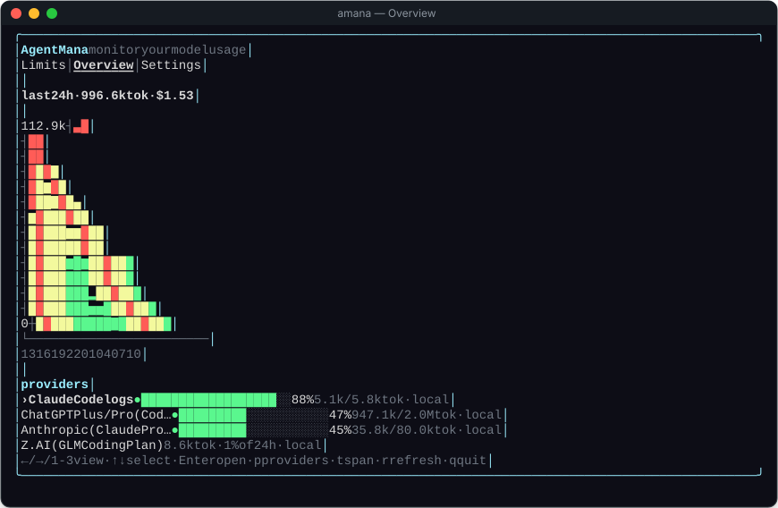
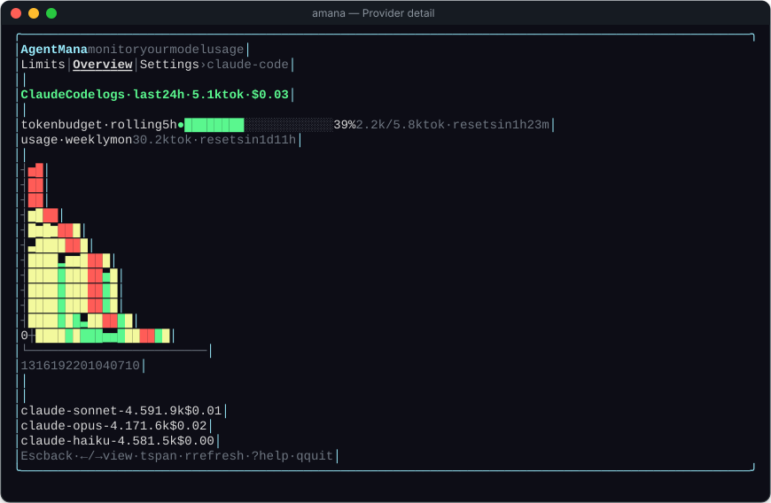
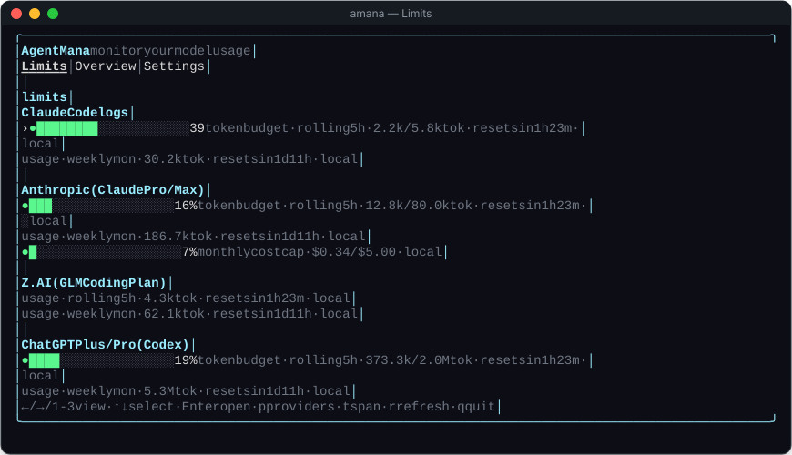
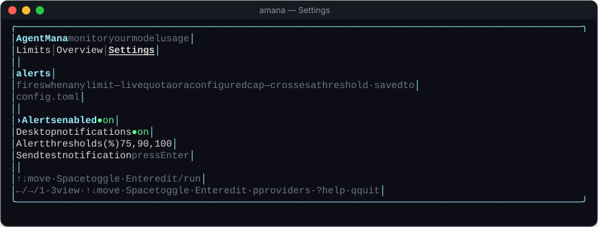
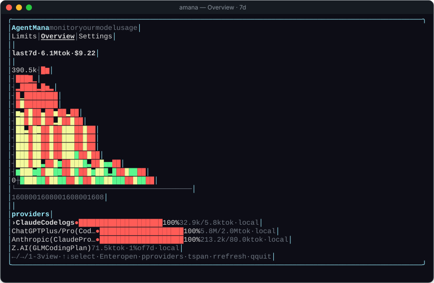

<p align="center">
  <h1 align="center">Agent Mana</h1>
  <p align="center"><strong>monitor your model usage</strong> — a single-binary Bun CLI + TUI for AI token & cost tracking.</p>
  <p align="center">
    <a href="LICENSE-MIT"></a>
    <a href="https://bun.sh"></a>
    
    
  </p>
</p>

<p align="center">
  
</p>
<p align="center"><sub>The Overview tab: an aggregate hourly heat chart (green → yellow → red) plus one usage bar per provider. <em>Screenshots use seeded sample data.</em></sub></p>

`amana` ingests AI usage from local agent logs and admin APIs, fetches live quota with your own OAuth/API credentials, stores everything in a local SQLite database, and reports per-provider usage against your configured windows and limits — with threshold alerts and a modern tabbed dashboard.

- **Local-first.** SQLite under your XDG data dir; nothing leaves the machine except the provider calls you opt into.
- **Multi-source ingestion.** Log sources (`omp`, `claude-code`) + admin APIs (`openai-api`, `anthropic-api`), incrementally tailed by byte offset + mtime.
- **Live quota.** Real limits pulled from 12+ providers (Anthropic, Codex, Z.AI, MiniMax, Gemini, Copilot, …).
- **Multiple accounts.** Log in to the same provider several times; each account is tracked separately.
- **Windows & limits.** Rolling / daily / weekly / monthly windows; per-provider token and monthly-cost caps.
- **Threshold alerts.** Desktop notification + in-TUI banner when a limit crosses 75/90/100% — deduped per window, re-armed after each reset.
- **Hourly spend.** Per-provider token/cost charts across 12h → all-time spans.

## Install

Requires [Bun](https://bun.sh) ≥ 1.1:

```bash
curl -fsSL https://bun.sh/install | bash
```

Pick one:

```bash
# 1. Global install (recommended; needs Bun at runtime)
bun add -g github:tommyldev/amana
amana --help

# 2. Standalone binary (no Bun needed at runtime)
git clone https://github.com/tommyldev/amana.git && cd amana && bun install && bun run build
install -Dm755 dist/amana ~/.local/bin/amana

# 3. Run from a checkout
git clone https://github.com/tommyldev/amana.git && cd amana && bun install && bun run start
```

## Quick start

```bash
amana report                      # sync + print today's totals and window status
amana login anthropic             # OAuth (browser) → live quota; run twice for two accounts
amana login openai-api            # admin key → cost ingestion
amana window set omp --type rolling --duration 5h
amana limit set anthropic --tokens 10000000 --cost 50
amana alerts set --thresholds 75,90,100 --desktop true
amana                             # launch the TUI (default)
```

Running from a checkout? Replace `amana` with `bun src/index.ts`.

## Commands

| Command | What it does |
| --- | --- |
| `amana` | Launch the tabbed TUI dashboard (default). |
| `amana report` | Sync + print today's totals and per-provider window status. |
| `amana sync [--full]` | Run ingestion now. `--full` re-reads from byte 0. |
| `amana usage [--json] [--provider <id>]` | Fetch live provider usage/quota. |
| `amana graph [--span 24] [--provider <id>]` | Plot the hourly token-usage rate as a text bar chart. |
| `amana login [<id>] [--api-key]` | Authenticate a provider (OAuth, device flow, or API/admin key). |
| `amana accounts list \| remove <id> [--account <label>]` | Manage stored accounts. |
| `amana window set <id> --type <t> …` | Configure the usage window (see below). |
| `amana limit set <id> [--cost] [--tokens]` | Set a per-window token and/or monthly cost cap. |
| `amana alerts set \| test` | Configure / fire-test threshold alerts. |

Window types — `--type rolling --duration 5h` · `daily` · `weekly --weekday mon` · `monthly --day 1`.

## Dashboard

<p align="center">
  
</p>
<p align="center"><sub>Drill into a provider (Enter) for its live limits, its own hourly chart, and a per-model token/cost table.</sub></p>

<table>
  <tr>
    <td width="50%" align="center"><br><sub><b>Limits</b> — every enabled provider's windows, caps and resets.</sub></td>
    <td width="50%" align="center"><br><sub><b>Settings</b> — alert thresholds and notifications.</sub></td>
  </tr>
</table>

<p align="center">
  
</p>
<p align="center"><sub>Press <code>t</code> to cycle the chart span: 12h → 24h → 48h → 7d → 30d → 90d → all-time.</sub></p>

| Key | Action |
| --- | --- |
| `1`/`2`/`3` or `←`/`→` | Limits / Overview / Settings |
| `↑`/`↓` or `k`/`j` | Move selection (wraps) |
| `Enter` | Overview: drill into provider · Settings: edit/toggle/run |
| `Space` | Toggle the selected setting |
| `Esc` | Back (`Esc` at top level quits) |
| `t` | Cycle chart span · `r` force refresh |
| `p` | Provider login overlay · `?`/`h` help · `q`/`Ctrl-C` quit |

The TUI syncs logs, fetches live usage, recomputes hourly spend, and evaluates alerts on a timer (default 60s) and on `r`. Alerts fire only from this loop — there is no background daemon.

## Providers

Two log aggregates are enabled by default; everything else is opted in via `amana login`.

| Id | Source / auth | Default window |
| --- | --- | --- |
| `omp` | `~/.omp/agent/sessions` (`*.jsonl`) | Rolling 5h |
| `claude-code` | `~/.claude/projects` (`*.jsonl`) | Rolling 5h + weekly |
| `anthropic` | OAuth (Claude Pro/Max) | Rolling 5h + weekly |
| `openai-codex` | OAuth (ChatGPT/Codex) | Rolling 5h + weekly |
| `minimax-code` / `-cn` | OAuth device flow | Rolling 5h + weekly |
| `google-gemini-cli` / `google-antigravity` | OAuth | Daily |
| `zai` | API key | Rolling 5h + weekly |
| `github-copilot` | API key (+ optional enterprise URL) | Monthly |
| `deepseek` | API key → account balance | Monthly |
| `opencode-go` | API key → OMP-observed spend | Rolling 5h + weekly + monthly |
| `openai-api` / `anthropic-api` | Admin key → cost ingestion | Monthly |

`amana usage --provider <id>` and the Limits tab also cover `kimi-code`, `cursor`, `deepseek`, `opencode-go`, `groq`, `ollama`, `xai-oauth`, and more where usage endpoints exist.

## Data & environment

For backward compatibility the on-disk layout keeps the historical `atop` names — an existing `config.toml`, `atop.db`, and settings are picked up as-is. Credentials are stored in a plaintext `credentials.json` (mode `0600`) in the data dir; if you are migrating from the old encrypted-keyring build, re-run `amana login <provider>` once.

| Variable | Effect |
| --- | --- |
| `ATOP_CONFIG_DIR` | Override the config dir (`config.toml`). |
| `ATOP_DATA_DIR` | Override the data dir (`atop.db`, `credentials.json`). |
| `ATOP_OMP_DIR` | Root for `omp` jsonl ingestion. |
| `ATOP_CLAUDE_DIR` | Root for `claude-code` jsonl ingestion. |

Defaults (Linux): config `${XDG_CONFIG_HOME:-~/.config}/atop`, data `${XDG_DATA_HOME:-~/.local/share}/atop`.

## Development

```bash
bun test            # full suite (hermetic: each disk test uses a temp ATOP_* dir)
bun run typecheck   # tsc --noEmit
bun run build       # single-binary ./dist/amana
```

Layout: `src/{config,db,window,ingest,auth,usage,alerts,report,cli,tui}` plus `registry.ts` and `price.ts`.

The screenshots in this README are regenerated from the real TUI rendered against seeded sample data:

```bash
bun scripts/shoot.ts    # writes docs/img/*.svg
```

Dual-licensed under either of [MIT](LICENSE-MIT) or [Apache-2.0](LICENSE-APACHE), at your option.
